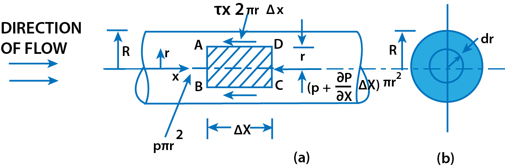
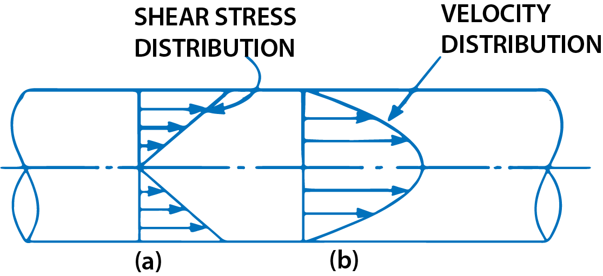
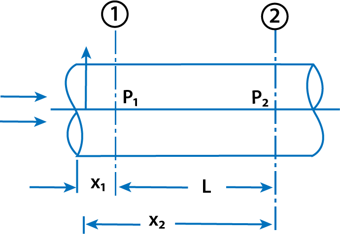

<h3>Introduction</h3>

    This chapter deals with the flow of fluids which are the viscous and flowing at very low velocity. At low velocity the fluid moves in layers. Each layer of the fluid slides over the adjacent layer. Due to relative velocty between two layers the velocity gradient $$ \frac{du}{dy} $$ exists and hence the shear stress $$ \tau = \mu \frac{du}{dy} $$  acts on the layers.

The following cases will be considered:

<ol>
    <li>Flow of viscous fluid through circular pipe.</li>
    <li>Flow of viscous fluid between two parallel plates.</li>
    <li>Kinetic energy correction and momentum correction factors.</li>
    <li>Power absorbed in visous flow through</li>
</ol>

(a) Journal bearings &nbsp;&nbsp;&nbsp;&nbsp;&nbsp; (b) Foot-step bearings &nbsp;&nbsp;&nbsp;&nbsp;&nbsp; (c) Collar bearings

<h3>Flow of Viscous Fluid through Circular Pipe</h3>

    For the flow of viscous fluid through circular pipe, the velocity distribution across a section, the ratio of maximum velocity to average velocity, the shear stress distribution and drop of pressure for a given length is to be determined. The flow through the circular pipe will be viscous or laminar, if the Reynolds number (Re*) is less than 2000. The expression for Reynold number is given by  

    $$ R_e = \frac{\rho V D}{\mu} $$

    where  
    &rho; = Density of fluid flowing through pipe  
    V = Average velocity of fluid  
    D = Diameter of pipe  
    &mu; = Viscosity of fluid  

$$ Fig\ 1.\ \ Viscous\ flow\ through\ a\ pipe  $$

    Consider a horizontal pipe of radius R. The viscous fluid is flowing from left to right in the pipe as shown in Fig 1 (a). Consider a fluid element of radius r, sliding in a cylindrical fluid element of radius (r + dr). Let the length of fluid element be &Delta;x. If 'p' is the intensity of pressure on the face AB, then the intensity of pressure on face CD will be $$ (p+\frac{\partial p}{\partial x} \Delta x) $$. Then the acting forces on the fluid elements are:

<ol>
    <li>The pressure force, p * &pi; r2 on face AB.</li>
    <li>The pressure force, $$ (p+\frac{\partial p}{\partial x} \Delta x) \pi r^2 $$ on face CD.</li>
    <li>The shear force, &tau; * 2 &pi;r &Delta;x on the surface of fluid element. As there are no accelaration, hence the summation of all forces in the direction of flow must be zero. </li>
</ol>

$$ p\pi r^2 - (p+\frac{\partial p}{\partial x} \Delta x) \pi r^2 - \tau * 2\pi r * \Delta x = 0 $$
$$ or - \frac{\partial p}{\partial x} \Delta x \pi r^2 - \tau * 2\pi r * \Delta x = 0 $$
$$ or - \frac{\partial p}{\partial x} . r - 2 \tau = 0 $$
$$ \tau = - \frac{\partial p}{\partial x} \frac{r}{2} \ \ \ \ \ ...(1) $$

The shear stress &tau; across a section varies with 'r' as $$ (p+\frac{\partial p}{\partial x}) $$ across a section is constant. Hence, shear stress distribution across a section is linear as shown in Fig 2. (a). 

$$ Fig\ 2.\ \ Shear\ stress\ and\ velocity\ distribution\ across\ a\ section  $$

<h3>Velocity Distribution</h3>

    To obtain the velocity distribution across a section, the value of shear stress $$ \tau = \mu \frac{du}{dy} $$ is substituted in equation 1.

But the relation, $$ \tau = \mu \frac{du}{dy} $$, y is measured from the pipe wall. Hence, 
y = R-r and dy = -dr  
$$ \therefore \ \ \ \ \  \tau = \mu \frac{du}{-dr} = - \mu \frac{du}{dr} $$

Substituting the value in equation (1), we get,
$$ - \mu \frac{du}{dr} = - \frac{\partial p}{\partial x} \frac{r}{2} $$
$$ or \ \ \ \ \ \frac{du}{dr} = \frac{1}{2\mu} \frac{\partial p}{\partial x} r $$

Integrating this above equation w.r.t 'r', we get

$$ u = \frac{1}{4\mu} \frac{\partial p}{\partial x} r^2 + C \ \ \ \ \ ...(2) $$

where C is the constant of integration and its value is obtained from its boundry condition that at r=R, u=0.

$$ \therefore \ \ \ \ \ 0 = \frac{1}{4\mu} \frac{\partial p}{\partial x} R^2 + C $$
$$ \therefore \ \ \ \ \ C = - \frac{1}{4\mu} \frac{\partial p}{\partial x} R^2 $$

Substituting this value of C in equation (2), we get,
$$ u = \frac{1}{4\mu} \frac{\partial p}{\partial x} r^2 - \frac{1}{4\mu} \frac{\partial p}{\partial x} R^2 $$
$$ = - \frac{1}{4\mu} \frac{\partial p}{\partial x} [R^2 - r^2] \ \ \ \ \ ...(3) $$

    In equation (3), values of &mu;, $$ \frac{\partial p}{\partial x} $$ and R are constant, which means the velocity , u varies with the square of r. Thus equation (3) is a equation of parabola. This shows that the velocity distribution across the section of a pipe is parabolic. This velocity distribution is shown in above Fig. 2 (b).

<h3>Ratio of maximum velocity to average velocity</h3>

The velocity is maximum when r=0 in equation (3). Thus maximum velocity, Umax is obtained as

$$ U_{max} = - \frac{1}{4\mu} \frac{\partial p}{\partial x} R^2 \ \ \ \ ...(4) $$

    The average velocity, $$ \bar{u}$$, is obtained by dividing the discharge of the fluid across the section by the area of the pipe (&pi;R2). The discharge (Q) across the section is obtained by considering the flow through a circular ring element of radius r and thickness dr as shown in Fig 1. (b). The fluid flowing per second through this elementary ring 

    $$ dQ\ =\ velocity\ at\ a\ radius\ r\ *\ area\ of\ ring\ element $$
    $$ = u * 2\pi r dr $$
    $$ - \frac{1}{4\mu} \frac{\partial p}{\partial x} [R^2 - r^2] * 2\pi r dr $$
    $$ Q = \int_{0}^{R}dQ =  \int_{0}^{R} - \frac{1}{4\mu} \frac{\partial p}{\partial x} (R^2 - r^2) * 2\pi r dr $$
    $$ = \frac{1}{4\mu} \frac{ - \partial p}{\partial x} * 2\pi \int_{0}^{R} (R^2 - r^2) rdr $$
    $$ = \frac{1}{4\mu} \frac{ - \partial p}{\partial x} * 2\pi \int_{0}^{R} (R^2r - r^3) dr $$
    $$ = \frac{1}{4\mu} \frac{ - \partial p}{\partial x} * 2\pi [\frac{R^2 r^2}{2} - \frac{r^4}{4}]_0^R $$
    $$ = \frac{1}{4\mu} \frac{ - \partial p}{\partial x} * 2\pi [\frac{R^4}{2} - \frac{R^4}{4}] $$
    $$ = \frac{1}{4\mu} \frac{ - \partial p}{\partial x} * 2\pi * \frac{R^4}{4} $$
    $$ = \frac{\pi}{8\mu} \frac{ - \partial p}{\partial x} * R^4 $$
    $$ \therefore Average\ velocity, \ \ \ \ \ \ \ \ \bar{u} = \frac{Q}{Area} = \frac{\frac{\pi}{8\mu} \frac{ - \partial p}{\partial x} * R^4}{\pi R^2} $$
    $$ or \ \ \ \ \ \bar{u} = \frac{1}{8\mu} (\frac{ - \partial p}{\partial x}) * R^2 \ \ \ \ \ ...(5) $$
    
    Dividing eq(4) by eq(5)

    $$ \frac{U_{max}}{\bar{u}} = \frac{- \frac{1}{4\mu} \frac{\partial p}{\partial x} R^2}{\frac{1}{8\mu} (\frac{ - \partial p}{\partial x}) * R^2} = 2.0 $$

    So, ratio of maximum velocity to average velocity = 2.0

<h3>Drop of pressure for a given length (L) of a pipe</h3>

From eq(5), we have,
    $$ \bar{u} = \frac{1}{8\mu} (\frac{ - \partial p}{\partial x}) R^2 $$
    $$ or \ \ \ \ \ \ \ (\frac{ - \partial p}{\partial x}) = \frac{8\mu \bar{u}}{R^2} $$

$$ Fig\ 3.  $$

    Integrating the above equation w.r.t to x, we get,

    $$ - \int^{1}_{2} dp = \int^{1}_{2} \frac{8\mu \bar{u}}{R^2} dx $$
    $$ \therefore \ \ \ \ \ -[p_1 - p_2] = \frac{8\mu \bar{u}}{R^2} [x_1 - x_2] or (p_1 - p_2) = \frac{8\mu \bar{u}}{R^2} [x_2 - x_1] $$
    $$ = \frac{8\mu \bar{u}}{R^2} L \ \ \ \ \ \ \ [\because \ \ \ x_2 - x_1 = L\ \ from\ Fig\ 3.] $$
    $$ = \frac{8\mu \bar{u} L}{D/2}^2  \ \ \ \ \ \ \ [\because \ \ \ R = \frac{D}{2}] $$

    $$ or \ \ \ \ \ \ (p_1 - p_2) = \frac{32\mu \bar{u} L}{D^2}, \ \ \ \ \ \ \ \ \ where\ (p_1 - p_2)\ is\ the\ drop\ of\ pressure $$
    $$ \therefore \ \ \ \ Loss\ of\ pressure\ head = \frac{p_1 - p_2}{\rho g} $$
    $$ \therefore \ \ \ \ \frac{p_1 - p_2}{\rho g} = h_f = \frac{32\mu \bar{u} L}{\rho g D^2} \ \ \ \ \ \ \ ...(6) $$

    Equation(6) is called Hagen Poiseuille Formula.

